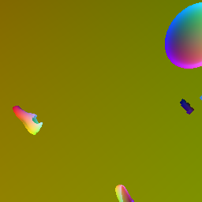

# proposals of generate scene flow


### pros:

after generate scene flow, we can directly use the same script to generate point trajs in 3d space.

### limitation:

write this script will take too much times, I believe it will take around 10 hours to code.

## get boundingbox in object coord 

download mesh file from //kubric-public/assets/GSO/*.tar.gz. where * is the mesh id, can get from `metadata["instances"][i]["asset_id"]`

```bash
gsutil cp -r gs://kubric-public/assets/GSO/*.tar.gz /home/lzq/workspace/movi_pc/assets

```
unzip the file, read data.json, the boundingbox is in `data["kwargs"]["bounds"]`
```json
"bounds": [
            [
                -40.0,
                -40.0,
                0.0
            ],
            [
                40.0,
                40.0,
                40.0
            ]
        ],

```

## read object coord image
object coord image:  


the coord contains RGB color c, represent x,y,z, this number is normalized, the true local coord is:  
 ```python
 (c / 255 * boundrange + upbound ) * scale 
```
scale can be extracted from metadata:  
`metadata["instances"][i]["scale"]`

another challenge is pair which point belong to which object, the easist way is to count how much pixel the object contain in certain frame, and compairs with  
`metadata["instances"][i]["visibility"][frame]`

## then calculate occolused scene flow 
use the diff position between this frame and next frame to calculate  
scene flow refers to: where position will points in this frame move when next frame.  
So we use the relative coord of the first frame, the correct position and rotation, and the `velocities`, `angular_velocities` of this frame to get the next frame`s position and rotation  
```python
#1, generate rot_next_frame from rot and angular_velocities
rot_next_frame = ...
#2, get obj_position_next_frame from obj_position and velocities
obj_position_next_frame = ...
#2, calculate the diff
global_space_points = (rot @ obj_space_points.T).T + obj_position.T
global_space_points_next_frame = (rot_next_frame @ obj_space_points.T).T + obj_position_next_frame.T
results = global_space_points_next_frame-global_space_points
```

 if you plan to reuse this code, please read my comments in the begin of each python file first, Movi_f have a lot of ******* tricks which cause the use of data very ... hard to comment ... 
